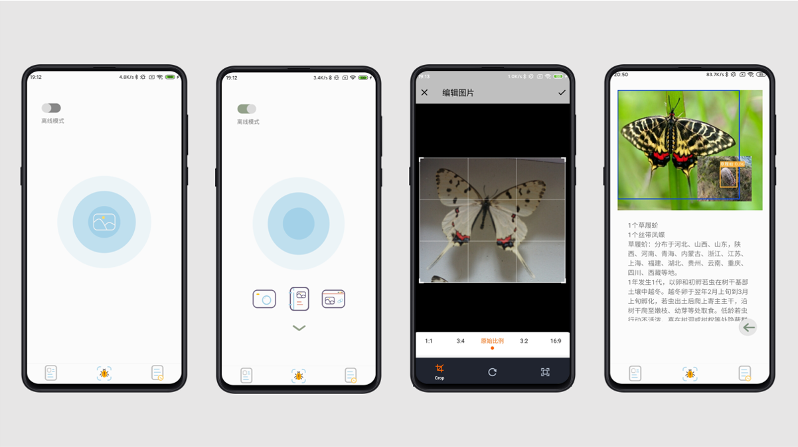

# 林业有害生物智能检测系统
# Forestry insect intelligent detection system

将目标检测算法部署到Android移动端，实现端侧推理，无网络的情况下也可以使用本app进行林业有害生物检测，并且检测时间控制在了200ms内。
除了图片检测功能外还包括了有害生物信息介绍、分布地图、识别历史记录等扩展功能。

The object detection algorithm is deployed to the Android mobile terminal to achieve end-side inference, and the app can be used for forestry insect detection without network, and the detection time is controlled within 200ms.
In addition to the image detection function also includes insect introduction, insect distribution map, image detection history and other extended functions.

## 使用说明
## Instructions for use

### 1.部署服务器端
### 1. deploy server side
服务器端代码位于server文件夹下
```bash
# 创建一个名为insect的anaconda环境：
$ conda create --name insect python=3.7.10
# 激活环境：
$ conda activate insect
# 路径切换到项目源代码目录下，安装项目依赖：
$ pip install -r requirements.txt
# 安装好依赖后运行insectDetectorServer.py文件
$ python insectDetectorServer.py
```
修改insectDetectorServer.py中链接数据库的代码（第87行到第91行、第112行到第116行、第130行到第135行），修改其中的user即password为你当前所部署的数据库的user和password，

### 2.修改Android代码
### 2.modify codes in Android side
修改java/com/tsw/insectdetector/tool/NetworkUtil.java中的HTTP_SEVER为你自己服务器URL，然后在Android Studio中运行即可🎉。

modify HTTP_SEVER in java/com/tsw/insectdetector/tool/NetworkUtil.java to your own server URL, run this project in Android Studio, and then enjoy it🎉.

## 注意事项
## Precautions
* 没有部署服务器前不能使用有害生物信息介绍和生物分布地图这两个功能，但是 __离线检测和历史记录可以正常使用__ 。
* The two functions of insect introduction and insect distribution map cannot be used without deploying the server, but __offline detection and history records can be used normally__ .

## 效果图
## Renderings


## 联系我
## contact me
tsw200027@gmail.com
